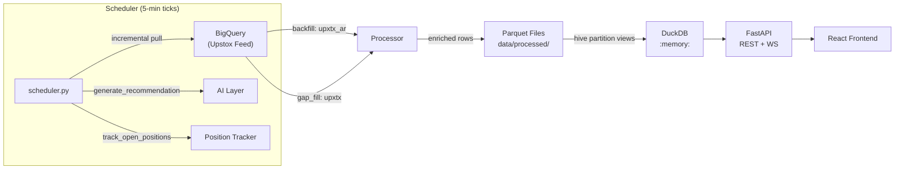
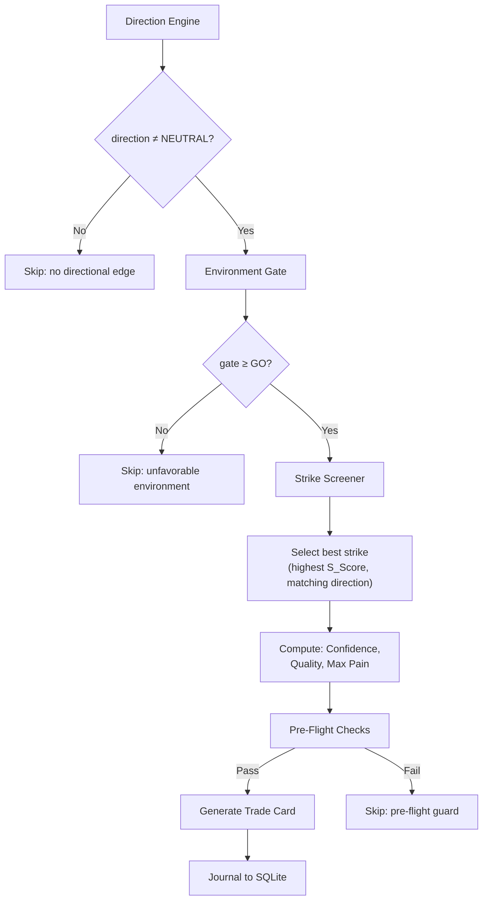

# OptDash — Complete Technical Reference

> **OptDash** is an NSE Index Options buying dashboard that ingests live option-chain data from BigQuery (Upstox feed), processes it through a multi-stage pipeline, stores it in Parquet files, and serves real-time analytics via a FastAPI + DuckDB backend powering a React frontend.

---

## Table of Contents

1. [Architecture Overview](#1-architecture-overview)
2. [Data Pipeline](#2-data-pipeline)
3. [Analytics: GEX (Gamma Exposure)](#3-gex-gamma-exposure)
4. [Analytics: Cost-of-Carry](#4-cost-of-carry-coc)
5. [Analytics: PCR (Put-Call Ratio)](#5-pcr-put-call-ratio)
6. [Analytics: IV (Implied Volatility)](#6-iv-implied-volatility)
7. [Analytics: VEX / CEX (Vanna & Charm Exposure)](#7-vex--cex-vanna--charm-exposure)
8. [Analytics: Strike Screener & S_Score](#8-strike-screener--s_score)
9. [Analytics: Alerts](#9-alerts)
10. [Environment Gate (11-Point System)](#10-environment-gate-11-point-system)
11. [Directional Bias Engine](#11-directional-bias-engine)
12. [AI Recommender Pipeline](#12-ai-recommender-pipeline)
13. [Confidence Score](#13-confidence-score)
14. [Quality Score & Grades](#14-quality-score--grades)
15. [Configuration Reference](#15-configuration-reference)

---

## 1. Architecture Overview



### Underlyings Tracked
`NIFTY`, `BANKNIFTY`, `FINNIFTY`, `MIDCPNIFTY`, `NIFTYNXT50`

### Data Flow
1. **BigQuery** stores raw Upstox option chain snapshots (every 5 min during NSE hours)
2. **Processor** normalizes types, computes Greeks-derived columns (GEX, VEX, CEX), assigns expiry tiers
3. **Writer** stores enriched data as Parquet files (`data/processed/trade_date=YYYY-MM-DD/UNDERLYING.parquet`)
4. **DuckDB** creates an in-memory view (`options_data`) over a rolling window of Parquet files
5. **Analytics** modules query DuckDB to compute real-time indicators
6. **AI Layer** combines analytics into trade recommendations

---

## 2. Data Pipeline

### 2.1 BQ Tables

| Table | Purpose | When Used |
|-------|---------|-----------|
| `upxtx_ar` | Historical archive (complete daily snapshots) | Backfill (startup) |
| `upxtx` | Rolling live feed (current day snapshots) | Gap fill + incremental (runtime) |

> `upxtx` is purged daily at **06:35 IST** (copied to `upxtx_ar`), so it is empty until NSE opens at 09:15.

### 2.2 Columns Pulled from BQ

```
record_time, underlying, instrument_type, instrument_key, option_type,
expiry_date, strike_price, underlying_spot, close, ltp, volume, oi,
total_buy_qty, total_sell_qty, iv, delta, theta, gamma, vega
```

### 2.3 Processor Transformations

| Step | Transformation |
|------|---------------|
| **Type normalization** | `OPTIDX` → `OPT`, `FUTIDX` → `FUT` |
| **Date normalization** | `M/D/YYYY` → `YYYY-MM-DD` ISO |
| **Price merge** | `ltp` with `close` fallback via `combine_first` |
| **Spot extraction** | `underlying_spot` → `spot` |
| **Bid/Ask mapping** | `total_buy_qty` → `bid_qty`, `total_sell_qty` → `ask_qty` |
| **Expiry tier** | `TIER1` (nearest), `TIER2` (2nd), `TIER3` (all others) |
| **DTE** | `(expiry_date - trade_date).days` |
| **Futures price** | Merged from the FUT row's LTP onto all OPT rows for the same snap |
| **GEX / VEX / CEX** | Computed per-strike (see §3, §7) |

### 2.4 Watermark System

- **File:** `data/watermark.json` — stores the latest successfully processed `record_time`
- **Backfill** uses `upxtx_ar` for historical days, sets watermark per completed day
- **Gap fill** uses `upxtx` for today's intraday windows, advances watermark after each successful fill
- **Incremental** pulls new rows from `upxtx` where `record_time > watermark`

---

## 3. GEX (Gamma Exposure)

### 3.1 Per-Strike GEX Formula

```
GEX = γ × OI × lot_size × spot² × 0.01 × direction
```

| Component | Description |
|-----------|------------|
| `γ` (gamma) | BSM gamma from BQ feed |
| `OI` | Open interest |
| `lot_size` | NSE contract lot (e.g., NIFTY=75) |
| `spot²` | Spot price squared |
| `0.01` | Scaling factor |
| `direction` | **CE = +1** (dealers long gamma → pinning), **PE = −1** (dealers short gamma) |

> Stored in Parquet raw. Analytics queries `SUM(gex) / 1e9` → display in ₹ Billions.

### 3.2 GEX Regime Classification

```python
if gex < 0:           → NEGATIVE_TREND      # dealers net short gamma — trending
elif pct_of_peak ≤ 70: → POSITIVE_DECLINING  # gamma wall weakening
else:                  → POSITIVE_CHOP       # strong gamma wall — mean-reversion
```

- **`pct_of_peak`** = `|current_gex| / day_peak_gex × 100`
- Threshold: `GEX_DECLINE_THRESHOLD = 0.70` (70%)

### 3.3 Max Pain

Vectorised NumPy outer-subtraction: for each candidate settlement strike, compute total pain (CE writers pay for ITM calls + PE writers pay for ITM puts), weighted by OI. The strike with minimum total pain is max pain.

```
pain(K) = Σ max(0, K - strike_i) × CE_OI_i + Σ max(0, strike_i - K) × PE_OI_i
max_pain = argmin(pain)
```

---

## 4. Cost-of-Carry (CoC)

### 4.1 CoC Calculation

```
CoC = AVG(fut_price) - AVG(spot)
```

- **Positive CoC** = futures at premium (normal contango, net long bias)
- **Negative CoC** = futures at discount (backwardation, bearish or dividend-adjusted)

### 4.2 V_CoC (Velocity of Cost-of-Carry)

```
V_CoC = CoC(now) - CoC(15 minutes ago)
```

Time window: true wall-clock 15 min (not snap count), computed via HH:MM cutoff.

### 4.3 CoC Signal Classification

| Condition | Signal |
|-----------|--------|
| `V_CoC > 10.0` | `VELOCITY_BULL` |
| `V_CoC < -10.0` | `VELOCITY_BEAR` |
| `CoC < -5.0` | `DISCOUNT` |
| Otherwise | `NORMAL` |

### 4.4 Order Book Imbalance (OBI)

**ATM OBI** — options order flow at the at-the-money strike:
```
OBI = [(CE_bid_flow - CE_ask_flow) - (PE_bid_flow - PE_ask_flow)] / total_qty
```

**Futures OBI** — institutional futures positioning:
```
Fut_OBI = (bid_qty - ask_qty) / (bid_qty + ask_qty)
```

---

## 5. PCR (Put-Call Ratio)

### 5.1 Calculation

```
PCR_Volume = PE_volume / CE_volume    (TIER1 options only)
PCR_OI     = PE_OI / CE_OI
Divergence = PCR_Volume - PCR_OI
```

### 5.2 Divergence Signals

| Condition | Signal | Meaning |
|-----------|--------|---------|
| `div > 0.25` | `RETAIL_PANIC_PUTS` | Retail buying puts aggressively (contrarian bullish) |
| `div < -0.20` | `RETAIL_PANIC_CALLS` | Retail buying calls aggressively (contrarian bearish) |
| `|div| > 0.10` | `DIVERGENCE_BUILDING` | Divergence forming |
| Otherwise | `BALANCED` | Normal activity |

### 5.3 Smoothed OBI

3-snap trailing average of per-snap OBI (15-minute smoothing using SQL window function).

---

## 6. IV (Implied Volatility)

### 6.1 IVR (IV Rank)

```
IVR = (ATM_IV - IV_Low) / (IV_High - IV_Low) × 100
```

- **Lookback:** 252 trading days (`IV_LOOKBACK_DAYS`)
- ATM IV = average IV of strikes closest to spot, TIER1 only

### 6.2 IVP (IV Percentile)

```
IVP = (days where daily_ATM_IV ≤ current_ATM_IV) / total_days × 100
```

- Minimum sample guard: **20 trading days** required, else returns `None`
- `None` → gate C5 treats as "IV not cheap" (conservative)

### 6.3 HV20 (Historical Volatility - 20 Day)

```
HV20 = STDDEV(daily_log_returns) × √252 × 100
daily_ret = ln(spot_today / spot_yesterday)
```

### 6.4 Term Structure Shape

```python
ratio = far_expiry_ATM_IV / near_expiry_ATM_IV

if ratio > 1.05:  → CONTANGO         # normal upward-sloping
if ratio < 0.95:  → BACKWARDATION    # inverted — elevated near-term risk
else:             → FLAT
```

ATM is defined as strikes within **1.5% of spot**.

---

## 7. VEX / CEX (Vanna & Charm Exposure)

### 7.1 VEX (Vanna Exposure)

Approximate BSM vanna:
```
σ = IV / 100
√T = √(DTE / 365)

vanna ≈ δ × (1 - |δ|) / (spot × σ × √T)
vanna = clip(vanna, -50, +50)              # P0-3: noise filter

VEX = OI × lot_size × vanna × spot / 1e6  # stored in ₹ Millions
```

### 7.2 CEX (Charm Exposure)

Approximate BSM charm:
```
charm ≈ -θ / (spot × σ × √T)
charm = clip(charm, -50, +50)              # P0-2: noise filter

CEX = OI × lot_size × charm / 1e6         # stored in ₹ Millions
```

### 7.3 VEX Signal Classification

Per-underlying thresholds (₹M):

| Underlying | VEX Threshold |
|------------|--------------|
| NIFTY | 0.50 |
| BANKNIFTY | 0.50 |
| FINNIFTY | 0.25 |
| MIDCPNIFTY | 0.15 |
| NIFTYNXT50 | 0.15 |

```python
if vex > threshold:   → VEX_BULLISH    # dealer long vanna → supports spot
if vex < -threshold:  → VEX_BEARISH    # dealer short vanna → spot pressure
else:                 → NEUTRAL
```

### 7.4 CEX Signal Classification

| Level | Condition | Signal |
|-------|-----------|--------|
| Strong | `cex ≥ CEX_CHARM_THRESHOLD` (20.0 for NIFTY) | `STRONG_CHARM_BID` |
| Bid | `cex ≥ CEX_VANNA_THRESHOLD` (12.0 for NIFTY) | `CHARM_BID` |
| Pressure | `cex ≤ -CEX_CHARM_THRESHOLD` | `CHARM_PRESSURE` |
| Neutral | Otherwise | `NEUTRAL` |

### 7.5 Dealer O'Clock

Active when **all 3 conditions** are true:
1. `DTE ≤ 1` (expiry day or day before)
2. `snap_time ≥ 14:00` (DEALER_OCLOCK_START)
3. Today is the correct weekly expiry weekday for this underlying (e.g., Thursday for NIFTY, Wednesday for BANKNIFTY)

> On DTE=1, dealer delta-hedging (charm flow) intensifies from ~14:00. The 14:00 start is intentionally earlier than the session boundary (14:30) to capture the 30-minute charm-distortion overlap.

---

## 8. Strike Screener & S_Score

### 8.1 S_Score Formula

Computed in SQL with 7 weighted factors:

```sql
S_Score = (
    W_DELTA     × |delta|
  + W_THETA     × (1 - min(1, |theta| / ltp / 0.05))
  + W_LIQUIDITY × min(1, OI × ltp / 1e7 / 5.0)
  + W_IV        × (1 - min(1, IV / 100))
  + W_GAMMA     × min(1, |gamma| × 100)
  + W_VEGA      × min(1, |vega| / 50)
  + W_EFF_RATIO × (1 - min(1, |theta| / ltp / 0.10))
) × 10
```

### 8.2 Default Weights

| Weight | Value | Factor |
|--------|-------|--------|
| `W_DELTA` | 4.0 | Directional sensitivity |
| `W_EFF_RATIO` | 4.0 | Theta efficiency at 10% cap |
| `W_LIQUIDITY` | 3.0 | OI × LTP liquidity (cap 5Cr) |
| `W_IV` | 2.0 | Lower IV = better (cap 100%) |
| `W_THETA` | 2.0 | Theta decay ratio (cap 5% daily) |
| `W_GAMMA` | 1.0 | Convexity (cap 0.01) |
| `W_VEGA` | 1.0 | IV sensitivity (cap 50 pts) |

### 8.3 Filters

| Filter | Default |
|--------|---------|
| Moneyness | ≤ 5% from spot |
| Delta range | 0.10 – 0.50 |
| Min liquidity | ≥ 0.5 Cr (OI × LTP / 1e7) |
| LTP | > 0 |

### 8.4 Star Rating

| Stars | S_Score Threshold |
|-------|-------------------|
| ⭐⭐⭐⭐ | ≥ 100 |
| ⭐⭐⭐ | ≥ 80 |
| ⭐⭐ | ≥ 60 |
| ⭐ | < 60 |

---

## 9. Alerts

Transition-based alerts from the last **60 minutes** of data. Alerts fire only on **state transitions** (not repeated on every tick).

| Alert Type | Trigger | Severity |
|-----------|---------|----------|
| **GEX Decline** | `pct_of_peak` crosses below 70% | HIGH |
| **V_CoC Spike** | CoC signal transitions to `VELOCITY_BULL/BEAR` | HIGH |
| **PCR Divergence** | Divergence crosses config thresholds | HIGH/MEDIUM |
| **Volume Spike** | Volume ratio exceeds rolling median significantly | HIGH (≥3x) / MEDIUM |

> **09:15 suppression:** Single-snap V_CoC alerts at market open are suppressed (opening auction anomaly).

---

## 10. Environment Gate (11-Point System)

The gate scores the current market environment on an 11-point scale:

| Gate | Condition | Points | Logic |
|------|-----------|--------|-------|
| **C1** | GEX Declining | 1 | `pct_of_peak ≤ 70%` — gamma wall weakening |
| **C2** | V_CoC Velocity | 1 | `|V_CoC| > 10` — momentum spike active |
| **C3** | Futures OBI | 1 | `|Fut_OBI| > 0.20` — strong directional conviction |
| **C4** | PCR Divergence | 1 | `div > 0.25` or `div < -0.20` — retail positioning extreme |
| **C5** | IV Cheap | 1 | `IVP < 50` — IV in lower half of historical range |
| **C6** | ATM OBI | 1 | `|OBI| > 0.10` — options order flow imbalance |
| **C7** | Term Structure OK | 1 | Shape ≠ `BACKWARDATION` — no inverted term structure |
| **C8** | Session OK | 1 | Not in `MIDDAY_CHOP` (11:30–13:00) |
| **C9** | VEX Aligned | **2** | VEX direction matches trade direction (requires CE/PE) |
| **C10** | Not Dealer O'Clock | 1 | No DTE=1 charm distortion active |

### Verdict Thresholds

| Score | Verdict |
|-------|---------|
| ≥ 7 | **GO** — trade environment favorable |
| ≥ 5 | **WAIT** — marginal conditions |
| < 5 | **NO_GO** — unfavorable, no recommendations |

---

## 11. Directional Bias Engine

5 weighted signals vote on CE or PE direction:

| Signal | Weight | CE Trigger | PE Trigger |
|--------|--------|-----------|-----------|
| **V_CoC Velocity** | 3 | `V_CoC > 10` or spike active + positive | `V_CoC < -10` or spike active + negative |
| **Futures OBI** | 2 | `Fut_OBI > |threshold|` (buyers dominate) | `Fut_OBI < threshold` (sellers dominate) |
| **VEX Alignment** | 2 | `VEX > per_underlying_threshold` | `VEX < -per_underlying_threshold` |
| **ATM OBI** | 1 | `OBI > 0.10` | `OBI < -0.10` |
| **PCR Divergence** | 1 | `div > 0.25` (retail panic puts → fade) | `div < -0.20` (retail panic calls → fade) |

**Max weight per side: 9**

### Decision Logic
- **Winner** = side with more weight → `CE` or `PE`
- **Tie** → `NEUTRAL` (no tradeable edge)
- **No signals** → `NEUTRAL`
- **Margin** = `|CE_weight - PE_weight|` (higher = stronger conviction)

### V_CoC Spike Persistence

A V_CoC spike remains active for up to `VCOC_SPIKE_EXPIRY_SNAPS` (3) snaps after the initial spike, even if V_CoC has returned below threshold. This prevents flip-flopping when momentum temporarily dips.

---

## 12. AI Recommender Pipeline

Every scheduler tick (5 min), for each underlying:



### Pre-Flight Guards

| Check | Condition |
|-------|-----------|
| Min gate score | ≥ 5 (≥ 7 on DTE=1) |
| Min confidence | ≥ 50 (≥ 65 on DTE=1) |
| Max theta ratio | `|theta| / ltp ≤ 3%` |
| Max pain proximity | spot not within 0.5% of max pain |
| Min S_Score | ≥ 60 |

### Trade Card Fields

| Field | Source |
|-------|--------|
| `strike_price`, `expiry_date`, `option_type` | Screener top pick |
| `entry_ltp` | Current LTP |
| `sl_price` | `ltp × (1 - AI_SL_PCT)` = ltp × 0.65 |
| `target_price` | `ltp × AI_TARGET_MULT` = ltp × 1.50 |
| `confidence` | 0–100 composite score |
| `quality_grade` | A/B/C/D |
| `gate_score`, `gate_verdict` | Environment gate output |
| `direction_signals` | Full signal breakdown |

---

## 13. Confidence Score

Four-bucket composite, max 100:

| Bucket | Max | Calculation |
|--------|-----|-------------|
| **Signal Alignment** | 40 | `margin × 7 + signal_count × 3` |
| **Gate Score** | 25 | `(gate_score / 11) × 25` |
| **Structural Quality** | 25 | IVP<50 (+6), Contango (+4), S_Score>80 (+7), GEX declining (+5), VEX aligned (+3) |
| **Historical Perf** | 10 | `win_rate × 12` (requires ≥ 5 past trades) |

### Session Adjustments
- **Midday Chop** (11:30–13:00): −10 penalty
- **Closing Crush** (14:30+): capped at 60

---

## 14. Quality Score & Grades

Three-component composite, max 100:

```
Quality = C1 + C2 + C3

C1 = min(35, S_Score / 120 × 35)       # Strike quality
C2 = min(35, gate_score / 11 × 35)     # Gate adequacy
C3 = min(30, confidence / 100 × 30)    # Confidence adequacy
```

| Grade | Threshold |
|-------|-----------|
| **A** | ≥ 80 |
| **B** | ≥ 65 |
| **C** | ≥ 50 |
| **D** | < 50 |

---

## 15. Configuration Reference

### Session Boundaries

| Parameter | Value | Meaning |
|-----------|-------|---------|
| `SESSION_OPENING_END` | 10:15 | Opening session ends |
| `SESSION_MIDDAY_START` | 11:30 | Midday chop begins |
| `SESSION_MIDDAY_END` | 13:00 | Midday chop ends |
| `SESSION_CLOSING_START` | 14:30 | Closing crush begins |
| `DEALER_OCLOCK_START` | 14:00 | DTE=1 charm distortion window |

### Lot Sizes (NSE Mar 2026)

| Underlying | Lot Size | Strike Interval | Expiry Day |
|-----------|----------|----------------|-----------|
| NIFTY | 75 | 50 pts | Thursday |
| BANKNIFTY | 15 | 100 pts | Wednesday |
| FINNIFTY | 40 | 50 pts | Tuesday |
| MIDCPNIFTY | 120 | 25 pts | Monday |
| NIFTYNXT50 | 10 | 50 pts | Friday |

### Key Thresholds

| Parameter | Value | Used By |
|-----------|-------|---------|
| `GEX_DECLINE_THRESHOLD` | 0.70 | Gate C1, GEX regime |
| `VCOC_BULL_THRESHOLD` | 10.0 | Gate C2, direction, alerts |
| `PCR_DIV_BULL_THRESHOLD` | 0.25 | Gate C4, direction, alerts |
| `PCR_DIV_BEAR_THRESHOLD` | -0.20 | Gate C4, direction, alerts |
| `OBI_THRESHOLD` | 0.10 | Gate C6, direction |
| `IV_LOOKBACK_DAYS` | 252 | IVR/IVP historical window |
| `GATE_GO_THRESHOLD` | 7 | Environment verdict |
| `GATE_WAIT_THRESHOLD` | 5 | Environment verdict |
| `AI_SL_PCT` | 0.35 | Stop-loss = ltp × 0.65 |
| `AI_TARGET_MULT` | 1.50 | Target = ltp × 1.50 |
| `TRAILING_STOP_ACTIVATION` | 0.20 | Activate trailing at +20% |
| `TRAILING_STOP_TRAIL_PCT` | 0.10 | Trail-down at 10% from peak |
| `VANNA_CLIP` / `CHARM_CLIP` | 50.0 | Noise filter for VEX/CEX |

### Pipeline Settings

| Parameter | Value | Purpose |
|-----------|-------|---------|
| `SCHEDULER_INTERVAL_SECONDS` | 300 | 5-min tick cycle |
| `DUCK_VIEW_LOOKBACK_DAYS` | 5 | Rolling DuckDB view window |
| `RAW_PARQUET_RETENTION_DAYS` | 3 | Raw file cleanup |
| `BACKFILL_START_DATE` | 2026-02-17 | First historical date |
| `GEX_SCALING` | 1e9 | Raw GEX → display in ₹B |
